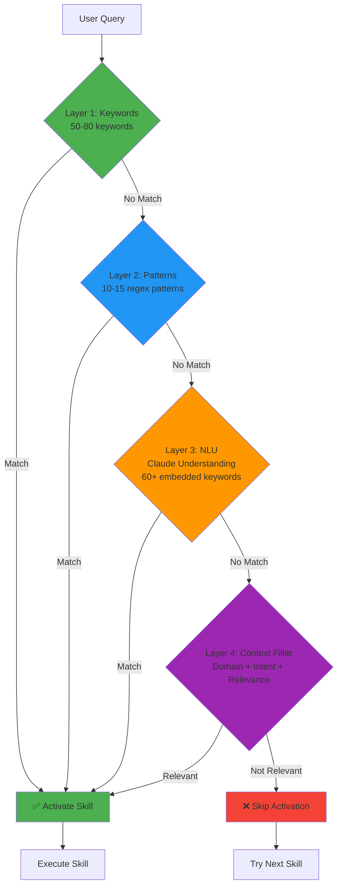
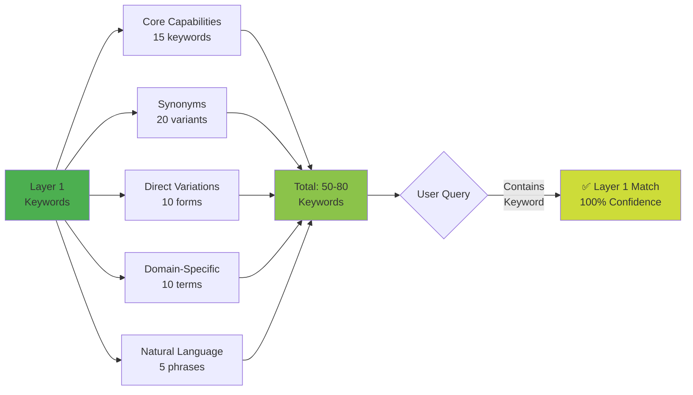
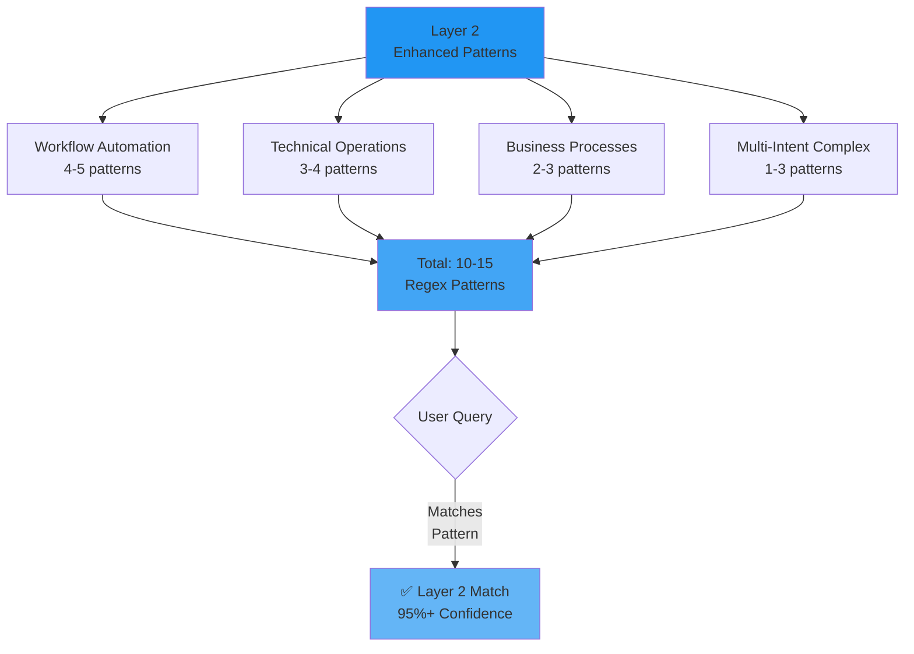
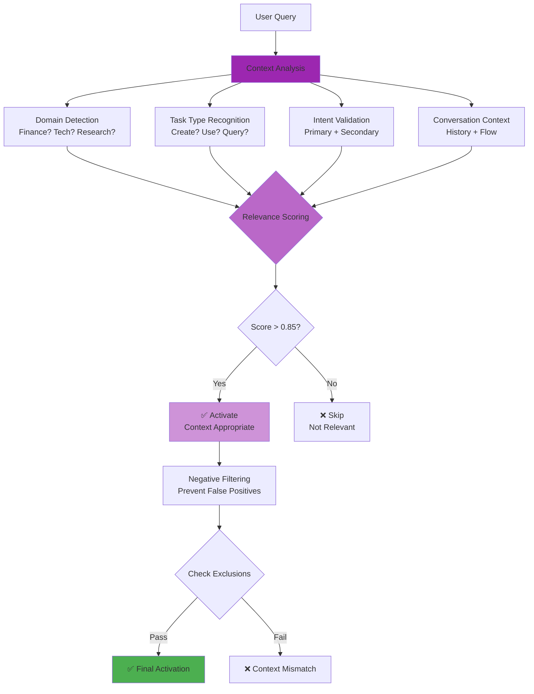
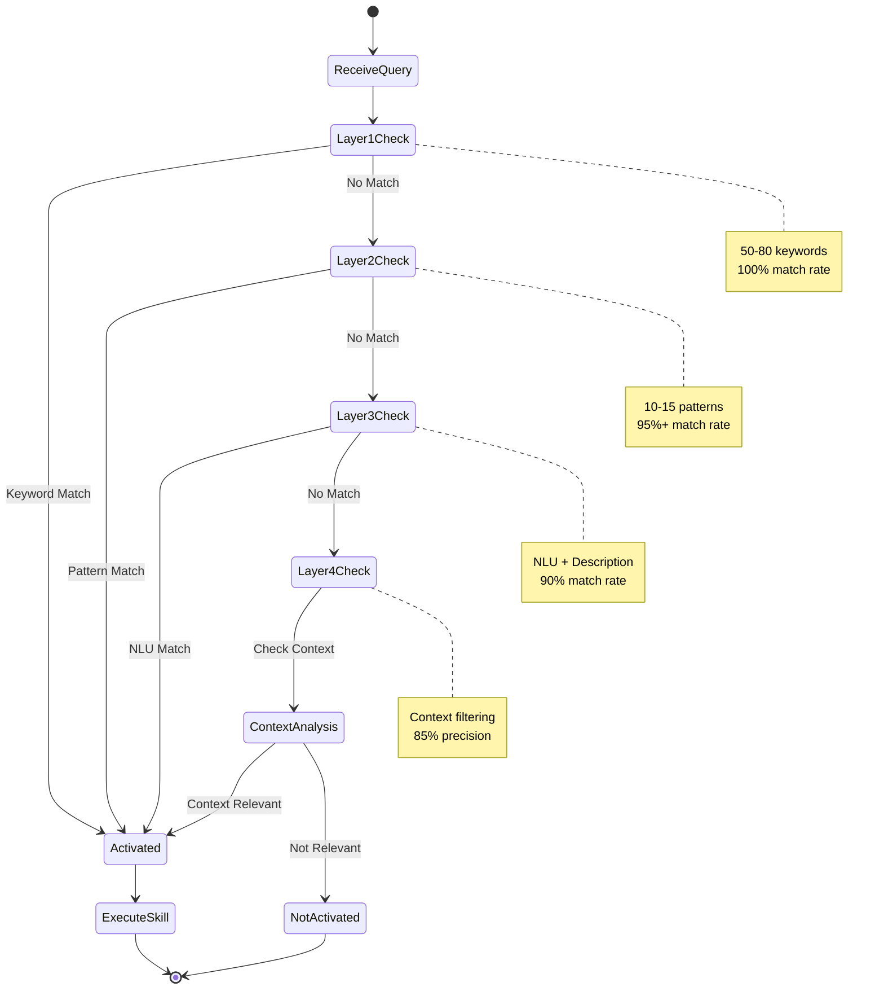
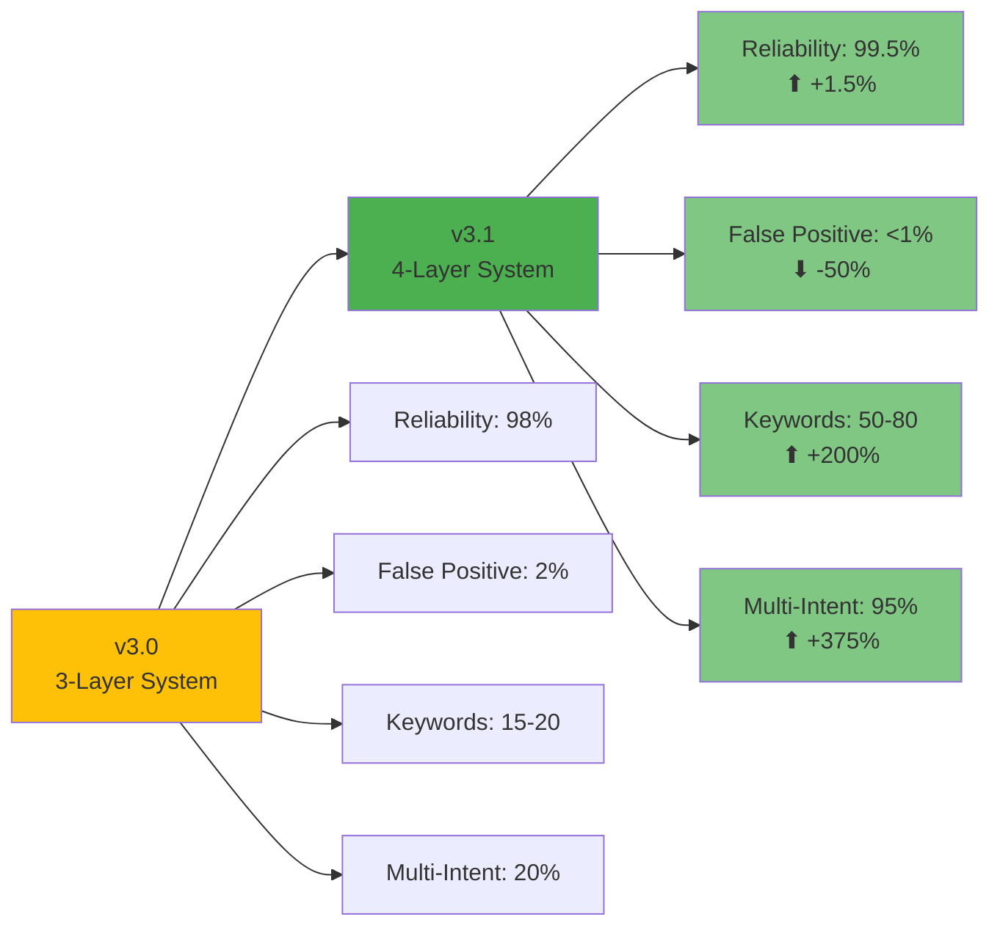
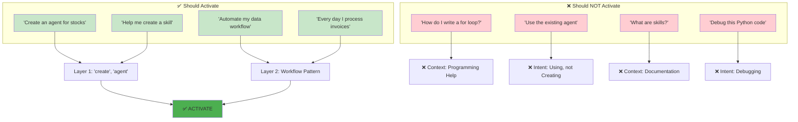

# 4-Layer Activation System Architecture

## Overview: 99.5% Reliability System

## Layer 1: Keyword Expansion System

## Layer 2: Pattern Matching System

## Layer 4: Context-Aware Filtering (NEW)

## Activation Decision Flow

## Performance Metrics Comparison

## Real-World Activation Examples

