# AgentDB Learning Loop Architecture

## Complete Learning Cycle

```mermaid
graph TB
    A[User Request<br/>'Create agent for stocks'] --> B[Agent Creator]
    B --> C{Uses Knowledge}
    C --> D[/references Directory]
    C --> E[AgentDB Data]

    D --> F[Agent Creation Process]
    E --> F

    F --> G[Skill Created<br/>✓ Functional code<br/>✓ Documentation<br/>✓ Tests]

    G --> H[(Store in AgentDB)]
    H --> I[Episodes]
    H --> J[Causal Edges]
    H --> K[Success Data]

    G --> L[Deploy & Use]
    L --> M[User Feedback]
    M --> H

    H --> N[Future Requests]
    N --> O{AgentDB Query}
    O --> P[Similar Episodes]
    O --> Q[Success Patterns]
    O --> R[Proven Templates]

    P --> B
    Q --> B
    R --> B

    style A fill:#e1f5ff
    style G fill:#d4edda
    style H fill:#fff3cd
    style B fill:#f8d7da
```

## Data Storage Structure

```mermaid
graph LR
    A[(AgentDB Database)] --> B[📚 Episodes<br/>Reflexion Store]
    A --> C[🔗 Causal Edges<br/>Cause-Effect]
    A --> D[🛠️ Skills Database<br/>Patterns]

    B --> B1[Episode #1<br/>Reward: 85.0<br/>Success: true]
    B --> B2[Episode #2<br/>Reward: 90.0<br/>Success: true]
    B --> B3[Episode #3<br/>Reward: 92.0<br/>Success: true]

    C --> C1[use_financial_template<br/>→ speed<br/>Uplift: 40%]
    C --> C2[use_yfinance_api<br/>→ satisfaction<br/>Uplift: 25%]
    C --> C3[use_caching<br/>→ performance<br/>Uplift: 60%]

    D --> D1[yfinance_fetcher<br/>Success: 82%]
    D --> D2[indicator_calculator<br/>Success: 78%]
    D --> D3[portfolio_analyzer<br/>Success: 85%]

    style A fill:#667eea
    style B fill:#764ba2
    style C fill:#f093fb
    style D fill:#4facfe
```



## Query & Enhancement Process

```mermaid
sequenceDiagram
    participant User
    participant Creator as Agent Creator
    participant AgentDB
    participant Skills as Skill Library
    participant Causal as Causal Memory
    participant Episodes

    User->>Creator: "Create financial agent"
    Creator->>AgentDB: Query similar experiences

    AgentDB->>Episodes: Search episodes
    Episodes-->>AgentDB: 3 similar (75% success)

    AgentDB->>Skills: Search patterns
    Skills-->>AgentDB: 3 relevant skills

    AgentDB->>Causal: Query effects
    Causal-->>AgentDB: 4 proven improvements

    AgentDB-->>Creator: Enhanced Intelligence:<br/>✓ Historical patterns<br/>✓ Success factors<br/>✓ Proven optimizations

    Creator->>User: ⚡ Creating with 40% speed boost<br/>🧠 Using proven yfinance API<br/>📊 Adding indicators (30% quality boost)

    Creator->>AgentDB: Store new episode
    Note over AgentDB: Learning for future
```



## Progressive Learning Timeline


## Intelligence Metrics Growth


