# Multi-Intent Detection System Visualizations

## Intent Hierarchy Architecture

```mermaid
graph TB
    Query[User Query:<br/>"Analyze stocks, create charts, and save results"] --> Primary

    Primary[Primary Intent] --> P1[analyze]

    Secondary[Secondary Intents] --> S1[and_visualize]
    Secondary --> S2[and_save]

    Contextual[Contextual Intents] --> C1[detailed_analysis]

    Meta[Meta Intent] --> M1[just_show_me]

    Primary --> Router{Intent Router}
    Secondary --> Router
    Contextual --> Router
    Meta --> Router

    Router --> Cap1[Capability 1:<br/>Stock Analysis]
    Router --> Cap2[Capability 2:<br/>Chart Generation]
    Router --> Cap3[Capability 3:<br/>Data Persistence]

    Cap1 --> Result[📊 Complete Result]
    Cap2 --> Result
    Cap3 --> Result

    style Query fill:#e3f2fd
    style Primary fill:#4caf50
    style Secondary fill:#2196f3
    style Contextual fill:#ff9800
    style Meta fill:#9c27b0
    style Result fill:#4caf50
```

## Intent Classification Process


## Intent Type Examples


## Complex Query Parsing Example


## Intent Confidence Scoring

```mermaid
graph LR
    subgraph "High Confidence (90-100%)"
        H1["'Create an agent'<br/>Primary: create<br/>98% confidence"]
        H2["'Analyze and visualize'<br/>Primary: analyze<br/>Secondary: visualize<br/>95% / 92%"]
    end

    subgraph "Medium Confidence (70-89%)"
        M1["'Help me with stocks'<br/>Primary: unknown<br/>Context: financial<br/>75% confidence"]
        M2["'Show me trends'<br/>Primary: monitor<br/>Context: real_time<br/>80% / 72%"]
    end

    subgraph "Low Confidence (<70%)"
        L1["'What should I do?'<br/>Primary: unknown<br/>Meta: help_me_decide<br/>45% confidence"]
    end

    H1 --> D1[✅ Execute Directly]
    H2 --> D1

    M1 --> D2[⚠️ Clarify Intent]
    M2 --> D2

    L1 --> D3[❌ Request Clarification]

    style H1 fill:#c8e6c9
    style H2 fill:#c8e6c9
    style M1 fill:#fff9c4
    style M2 fill:#fff9c4
    style L1 fill:#ffcdd2
```



## Intent Routing Decision Tree

```mermaid
graph TB
    Start[Parse User Query] --> Primary{Primary Intent<br/>Detected?}

    Primary -->|Yes, High Confidence| Secondary{Secondary Intents?}
    Primary -->|Low Confidence| Clarify1[Request Clarification]

    Secondary -->|Yes| Validate{All Intents<br/>Supported?}
    Secondary -->|No| SingleIntent[Execute Single Intent]

    Validate -->|Yes| CreatePlan[Create Multi-Step<br/>Execution Plan]
    Validate -->|No| Fallback[Execute Supported<br/>Intents Only]

    CreatePlan --> Priority{Prioritize<br/>Intents}

    Priority --> Seq[Sequential Execution:<br/>Primary → Secondary]
    Priority --> Par[Parallel Execution:<br/>Independent Intents]

    Seq --> Execute1[Execute Plan]
    Par --> Execute1

    Execute1 --> Monitor{Monitor<br/>Execution}

    Monitor -->|Success| Result[✅ Complete Result]
    Monitor -->|Partial Success| PartialResult[⚠️ Partial Result +<br/>Error Report]
    Monitor -->|Failure| Error[❌ Error +<br/>Fallback Options]

    style Start fill:#e3f2fd
    style Primary fill:#ffd54f
    style CreatePlan fill:#4caf50
    style Result fill:#4caf50
    style PartialResult fill:#ff9800
    style Error fill:#f44336
```



## Real-World Multi-Intent Examples


## Intent Accuracy Improvement (v3.0 → v3.1)


