# Performance Metrics & Visualizations

## Time Savings Impact Chart

```mermaid
%%{init: {'theme':'base', 'themeVariables': { 'primaryColor':'#4CAF50'}}}%%
graph LR
    subgraph "Before Agent Creator"
        B1[Financial Analysis<br/>2h/day] --> BR1[❌ 60h/month]
        B2[Inventory Mgmt<br/>1.5h/day] --> BR2[❌ 45h/month]
        B3[Research Collection<br/>8h/week] --> BR3[❌ 32h/month]
        B4[Report Generation<br/>3h/week] --> BR4[❌ 12h/month]
    end

    subgraph "After Agent Creator"
        A1[Financial Analysis<br/>5min/day] --> AR1[✅ 2.5h/month]
        A2[Inventory Mgmt<br/>3min/day] --> AR2[✅ 1.5h/month]
        A3[Research Collection<br/>20min/week] --> AR3[✅ 1.5h/month]
        A4[Report Generation<br/>10min/week] --> AR4[✅ 0.75h/month]
    end

    BR1 --> S1[96% Time Saved<br/>💰 $4,200/month]
    BR2 --> S2[97% Time Saved<br/>💰 $3,150/month]
    BR3 --> S3[95% Time Saved<br/>💰 $2,100/month]
    BR4 --> S4[94% Time Saved<br/>💰 $805/month]

    style B1 fill:#ffcdd2
    style B2 fill:#ffcdd2
    style B3 fill:#ffcdd2
    style B4 fill:#ffcdd2
    style A1 fill:#c8e6c9
    style A2 fill:#c8e6c9
    style A3 fill:#c8e6c9
    style A4 fill:#c8e6c9
    style S1 fill:#4caf50
    style S2 fill:#4caf50
    style S3 fill:#4caf50
    style S4 fill:#4caf50
```

## ROI Growth Over Time

## Version Performance Comparison

## Activation System Performance (v3.0 vs v3.1)

```mermaid
graph LR
    subgraph "v3.0 Metrics"
        A1[Reliability: 98%]
        A2[False Positive: 2%]
        A3[Keywords: 15-20]
        A4[Patterns: 5-7]
        A5[Multi-Intent: 20%]
        A6[NL Coverage: 60%]
    end

    subgraph "v3.1 Metrics"
        B1[Reliability: 99.5%<br/>⬆ +1.5%]
        B2[False Positive: <1%<br/>⬇ -50%]
        B3[Keywords: 50-80<br/>⬆ +200%]
        B4[Patterns: 10-15<br/>⬆ +100%]
        B5[Multi-Intent: 95%<br/>⬆ +375%]
        B6[NL Coverage: 90%<br/>⬆ +50%]
    end

    A1 -.-> B1
    A2 -.-> B2
    A3 -.-> B3
    A4 -.-> B4
    A5 -.-> B5
    A6 -.-> B6

    style A1 fill:#fff3e0
    style A2 fill:#fff3e0
    style A3 fill:#fff3e0
    style A4 fill:#fff3e0
    style A5 fill:#fff3e0
    style A6 fill:#fff3e0
    style B1 fill:#4caf50
    style B2 fill:#4caf50
    style B3 fill:#4caf50
    style B4 fill:#4caf50
    style B5 fill:#4caf50
    style B6 fill:#4caf50
```

## Business Impact by Industry

## Agent Creation Speed Over Time

```mermaid
graph LR
    T1[Creation #1<br/>60 minutes<br/>No learning data] --> T2[Creation #5<br/>50 minutes<br/>⬇ 17%<br/>Basic patterns]
    T2 --> T3[Creation #10<br/>36 minutes<br/>⬇ 40%<br/>⚡ Optimized]
    T3 --> T4[Creation #30<br/>25 minutes<br/>⬇ 58%<br/>🌟 Personalized]
    T4 --> T5[Creation #100<br/>18 minutes<br/>⬇ 70%<br/>🚀 Expert]

    style T1 fill:#ffcdd2
    style T2 fill:#fff9c4
    style T3 fill:#fff59d
    style T4 fill:#c8e6c9
    style T5 fill:#4caf50
```

## Quality Metrics Dashboard

## User Growth & Engagement

## Success Rate by Domain

## Feature Adoption Rate

