# Pipeline Architecture Diagrams

## Simple Pipeline (2-3 Stages)

## Complex Pipeline (Research Workflow)

## Business Intelligence Pipeline

```mermaid
flowchart TD
    Start([Business Data Sources]) --> A[Stage 1:<br/>Data Sources Connection]
    A --> B[Stage 2:<br/>ETL Process]
    B --> C[Stage 3:<br/>Analytics Engine]
    C --> D[Stage 4:<br/>Dashboard Creation]
    C --> E[Stage 5:<br/>Alert System]

    A --> A1[(Raw Data)]
    B --> B1[(Processed Data)]
    C --> C1[(KPI Metrics)]
    D --> D1[📊 Dashboard]
    E --> E1[🔔 Alerts]

    D1 --> End1([Business Users])
    E1 --> End2([Stakeholders])

    style Start fill:#e3f2fd
    style A fill:#bbdefb
    style B fill:#90caf9
    style C fill:#64b5f6
    style D fill:#42a5f5
    style E fill:#2196f3
    style End1 fill:#c8e6c9
    style End2 fill:#c8e6c9
```

## E-commerce Analytics Pipeline

## HR Automation Pipeline

## Pipeline Decision Logic

## Pipeline vs Components Comparison

```mermaid
graph TB
    subgraph "Pipeline Approach"
        P1[One Sequential Flow] --> P2[Automatic Orchestration]
        P2 --> P3[Data Flows Through]
        P3 --> P4[Cumulative Value]
    end

    subgraph "Component Approach"
        C1[Multiple Independent] --> C2[Manual Coordination]
        C2 --> C3[Isolated Data]
        C3 --> C4[Additive Value]
    end

    P4 --> Result1[Best for:<br/>• Single process<br/>• End-to-end flow<br/>• Sequential steps]
    C4 --> Result2[Best for:<br/>• Multiple processes<br/>• Modularity<br/>• Specialization]

    style P1 fill:#e8f5e9
    style P2 fill:#c8e6c9
    style P3 fill:#a5d6a7
    style P4 fill:#81c784
    style C1 fill:#e3f2fd
    style C2 fill:#bbdefb
    style C3 fill:#90caf9
    style C4 fill:#64b5f6
```

## Real-World Pipeline Flow Example

```mermaid
sequenceDiagram
    participant User
    participant Pipeline as E-commerce Pipeline
    participant Stage1 as Sales Ingestion
    participant Stage2 as Enrichment
    participant Stage3 as Analytics
    participant Stage4 as Dashboard
    participant Stage5 as Alerts

    User->>Pipeline: Request daily analytics
    Pipeline->>Stage1: Fetch sales data
    activate Stage1
    Stage1-->>Pipeline: raw_sales.json
    deactivate Stage1

    Pipeline->>Stage2: Enrich with customer data
    activate Stage2
    Stage2-->>Pipeline: enriched_sales.json
    deactivate Stage2

    Pipeline->>Stage3: Analyze behavior patterns
    activate Stage3
    Stage3-->>Pipeline: analytics_results.json
    deactivate Stage3

    Pipeline->>Stage4: Generate dashboard
    activate Stage4
    Stage4-->>User: 📊 Interactive Dashboard
    deactivate Stage4

    Pipeline->>Stage5: Check alert conditions
    activate Stage5
    Stage5-->>User: 🔔 Important Alerts
    deactivate Stage5

    Note over User,Stage5: Complete flow in 30 seconds<br/>vs 2 hours manual work
```

