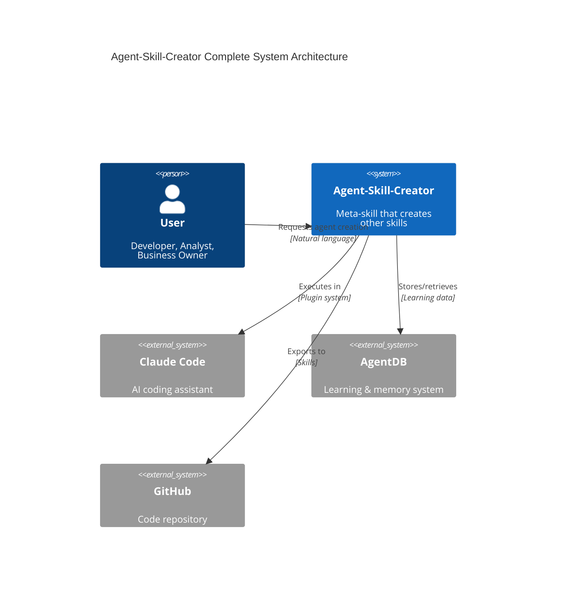
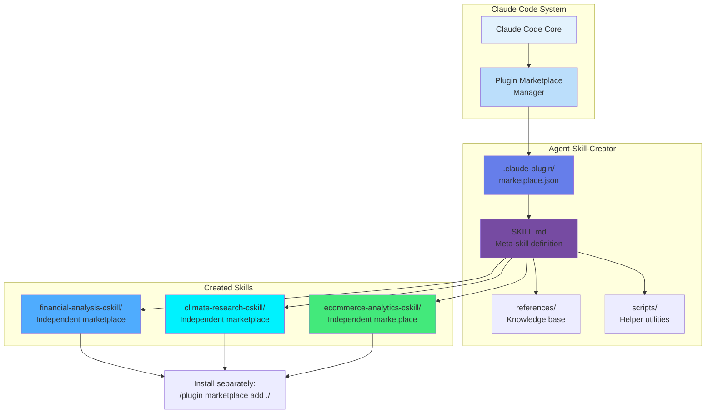
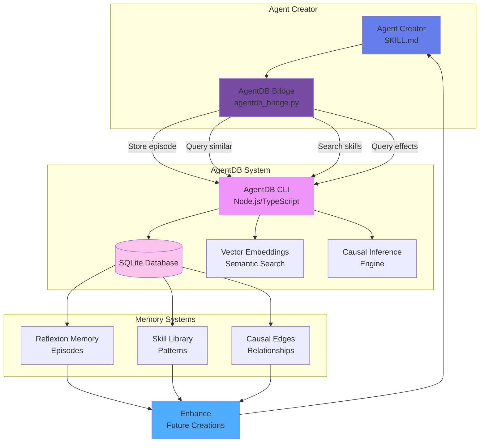
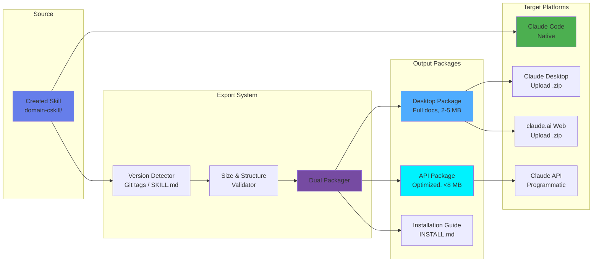
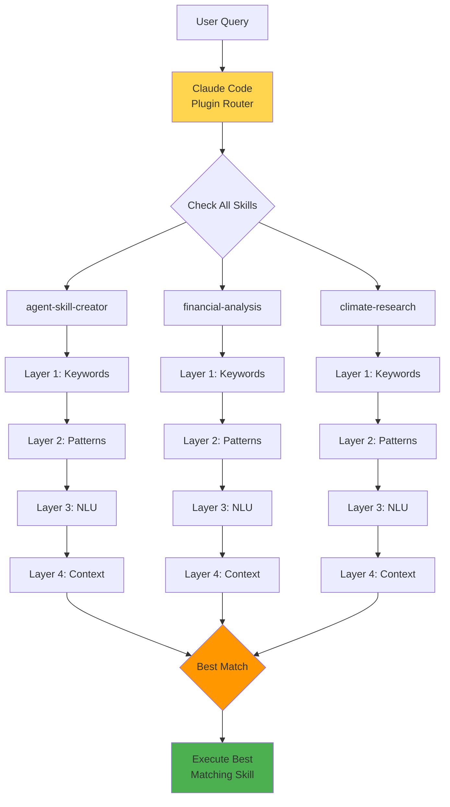
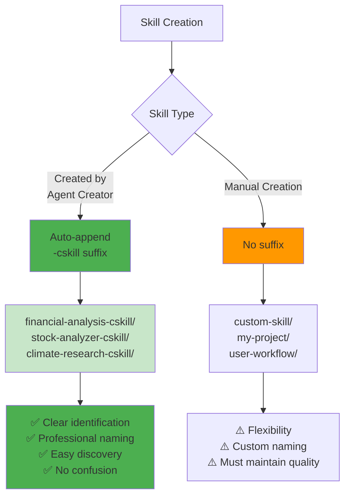

# System Integration Architecture

## Complete System Architecture



## Technical Component Architecture

```mermaid
graph TB
    subgraph "User Interface Layer"
        UI1[Natural Language<br/>User Queries]
        UI2[Claude Code CLI]
    end

    subgraph "Agent Creator Core"
        Core1[SKILL.md<br/>Main Orchestrator]
        Core2[Phase Executors<br/>6-phase system]
        Core3[Decision Engine]
    end

    subgraph "Knowledge Base"
        KB1[/references Directory<br/>Methodologies & Guides]
        KB2[Templates<br/>Pre-built patterns]
        KB3[Examples<br/>Working implementations]
    end

    subgraph "Intelligence Layer"
        AI1[AgentDB Bridge]
        AI2[Episode Memory]
        AI3[Skill Library]
        AI4[Causal Memory]
    end

    subgraph "Output Layer"
        OUT1[Generated Skills<br/>domain-cskill/]
        OUT2[Documentation<br/>README, SKILL.md]
        OUT3[Export Packages<br/>Cross-platform .zip]
    end

    UI1 --> UI2
    UI2 --> Core1
    Core1 --> Core2
    Core2 --> Core3

    Core2 --> KB1
    Core2 --> KB2
    Core2 --> KB3

    Core3 --> AI1
    AI1 --> AI2
    AI1 --> AI3
    AI1 --> AI4

    AI1 --> Core2

    Core2 --> OUT1
    Core2 --> OUT2
    Core2 --> OUT3

    style Core1 fill:#667eea
    style AI1 fill:#f093fb
    style OUT1 fill:#4facfe
```

## Data Flow Architecture

```mermaid
flowchart TB
    Input[User Input:<br/>'Create financial agent'] --> Parse[Parse & Analyze]

    Parse --> Phase1[Phase 1: Discovery<br/>Research APIs & Data]
    Phase1 --> Phase2[Phase 2: Design<br/>Define Use Cases]
    Phase2 --> Phase3[Phase 3: Architecture<br/>Plan Structure]
    Phase3 --> Phase4[Phase 4: Detection<br/>Activation System]
    Phase4 --> Phase5[Phase 5: Implementation<br/>Write Code]
    Phase5 --> Phase6[Phase 6: Testing<br/>Validate & Test]

    Phase1 -.-> Refs1[/references/<br/>phase1-discovery.md]
    Phase2 -.-> Refs2[/references/<br/>phase2-design.md]
    Phase3 -.-> Refs3[/references/<br/>phase3-architecture.md]
    Phase4 -.-> Refs4[/references/<br/>phase4-detection.md]
    Phase5 -.-> Refs5[/references/<br/>phase5-implementation.md]
    Phase6 -.-> Refs6[/references/<br/>phase6-testing.md]

    Phase1 -.-> AI[(AgentDB)]
    Phase2 -.-> AI
    Phase3 -.-> AI
    Phase4 -.-> AI
    Phase5 -.-> AI
    Phase6 -.-> AI

    AI -.-> Phase1
    AI -.-> Phase2
    AI -.-> Phase3
    AI -.-> Phase4
    AI -.-> Phase5
    AI -.-> Phase6

    Phase6 --> Output[Generated Skill:<br/>financial-analysis-cskill/]

    Output --> Store[Store Episode<br/>in AgentDB]
    Store --> Future[Enhance Future<br/>Creations]

    style Parse fill:#e1f5ff
    style Phase1 fill:#fff9c4
    style Phase2 fill:#fff59d
    style Phase3 fill:#ffee58
    style Phase4 fill:#ffeb3b
    style Phase5 fill:#fdd835
    style Phase6 fill:#fbc02d
    style Output fill:#4caf50
    style AI fill:#9c27b0
```

## Plugin Marketplace Architecture



## AgentDB Integration Architecture



## Cross-Platform Export Architecture



## Activation System Integration



## Naming Convention System


